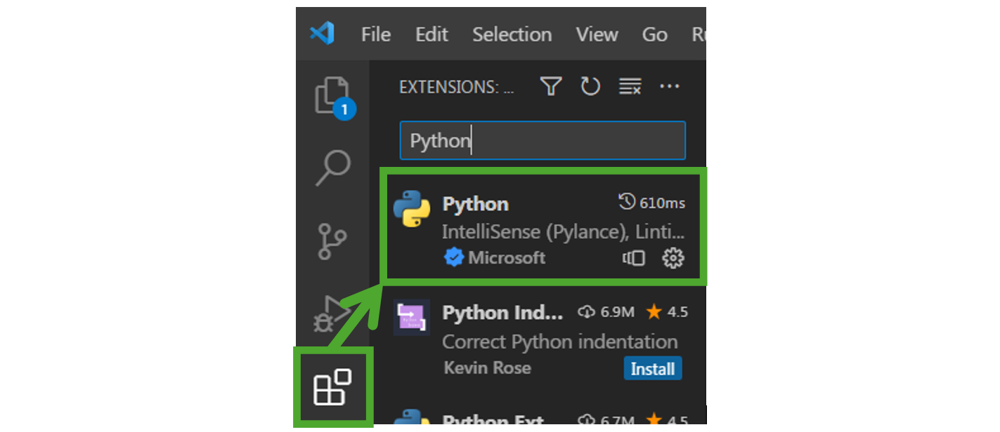

# 2. Programmierung

## 2.1. Software und Tools

Verwendet wird Python als Programmiersprache. Python ist für so gut wie jedes Betriebssystem verfügbar. Von der Website …

https://www.python.org/downloads/

… ist dabei die aktuelle Version der Programmiersprache zu installieren.
    
Als Programmierumgebung nutzen wir Visual Studio Code. Auch dieser Editor steht für die meisten Betriebssysteme zur Verfügung. Heruntergeladen werden kann dieser Editor von folgender Website.
    
https://code.visualstudio.com/

Damit dieser Editor Python-Dateien direkt ausführen kann, wird noch ein Plugin benötigt. Um Plugins in Visual Studio Code zu installieren, kannst du dich am folgenden Screenshot orientieren.

Zum Zwecke der Dokumentation des Programmieren Lernens und für das Verteilen von Aufgaben nutzen wir den sogenannten JupyterHub. Eine Instanz ist davon unter …

https://hub.binkert-patrick.de

… für euch installiert. Innerhalb dieses Tools ist es möglich textuelle Beschreibungen und Erklärungen direkt mit ausführbaren Python Code zu verbinden. Nachfolgend ist Platz für eure Zugangsdaten zum JupyterHub.

**Hinweis:**   
Zu **allen Leistungsüberprüfungen**, die die Programmierung betreffen, darf die erstellte Dokumentation im JupyterHub genutzt werden. Dies entspricht auch der Realität als Entwicklerin oder Entwickler, wo ein Internetzugang und die Möglichkeit der Recherche immer gegeben ist. Dabei sein ein **hilfsmittelfreier Teil NICHT** ausgeschlossen. 

## 2.2. Geschichte von Python

Guido van Rossum schrieb 1996 über die Entstehung des Namens seiner Programmiersprache: "Vor über sechs Jahren, im Dezember 1989, suchte ich nach einem 'Hobby'-Programmier-Projekt, dass mich über die Woche um Weihnachten beschäftigen konnte. Mein Büro ... war zwar geschlossen, aber ich hatte einen PC und sonst nichts vor. Ich entschloss mich einen Interpreter für die neue Skripting-Sprache zu schreiben, über die ich in der letzten Zeit nachgedacht hatte: ein Abkömmling von ABC, der UNIX/C-Hackern gefallen würde. Python hatte ich als Arbeitstitel für das Projekt gewählt, weil ich in einer leicht respektlosen Stimmung war (und ein großer Fan von Monty Python's Flying Circus).„

Guido van Rossum sagte in einem Interview: "Anfang der 80er Jahre habe ich an der CWI mit einem Team an der Sprache ABC gearbeitet. Ich hatte keine Ahnung wie ABC Python beeinflussen würde. Ich dachte an meine Erfahrungen und an den Frust mit ABC, und ich entschied mich eine einfache Skriptsprache zu entwerfen. Sie sollte die Vorteile von ABC haben, nicht aber die Probleme/Nachteile. Es entstand eine einfache virtuelle Maschine, ein einfacher Parser, eine einfache Laufzeitumgebung und eine Syntax, die Einrückungen für die Gruppierung von Ausdrücken verwendet, und ein paar Datentypen: Dictionaries, Listen, Strings und Numbers/Integer."

## ZEN of Python! (original)

**Beautiful is better than ugly.**  
**Explicit is better than implicit.**  
**Simple is better than complex.**  
**Complex is better than complicated.**  
**Flat is better than nested.**  
**Sparse is better than dense.**  
**Readability counts.**  
Special cases aren't special enough to break the rules.  
Although practicality beats purity.  
Errors should never pass silently.  
Unless explicitly silenced.  
In the face of ambiguity, refuse the temptation to guess.  
There should be one-- and preferably only one --obvious way to do it.  
Although that way may not be obvious at first unless you're Dutch.  
Now is better than never.  
Although never is often better than *right* now.  
**If the implementation is hard to explain, it's a bad idea.**  
**If the implementation is easy to explain, it may be a good idea.**  
Namespaces are one honking great idea -- let's do more of those!  

## ZEN of Python! (übersetzt)

**Schön ist besser als hässlich.**   
**Explizit ist besser als implizit.**   
**Einfach ist besser als komplex.**   
**Komplex ist besser als kompliziert.**   
**Flach ist besser als verschachtelt.**   
**Sparsam ist besser als dicht.**   
**Lesbarkeit zählt.**   
Sonderfälle sind nicht speziell genug, um die Regeln zu brechen.   
Obwohl die Praktikabilität die Reinheit übertrifft.   
Fehler sollten niemals schweigend vorübergehen.   
Es sei denn, es wird ausdrücklich zum Schweigen gebracht.   
Angesichts der Mehrdeutigkeit, widerstehen Sie der Versuchung zu raten.   
Es sollte einen - und vorzugsweise nur einen - naheliegenden Weg geben, es zu tun.   
Obwohl das anfangs nicht offensichtlich ist, es sei denn, man ist Holländer.   
Jetzt ist besser denn je.   
Obwohl nie oft besser ist als *richtig* jetzt.   
**Wenn die Umsetzung schwer zu erklären ist, ist es eine schlechte Idee.**   
**Wenn die Umsetzung leicht zu erklären ist, kann es eine gute Idee sein.**   
Namespaces sind eine tolle Idee - lasst uns mehr davon machen!   

## 2.3. Klassifizierung von Programmiersprachen

Low-Level-Languages | Art |  High-Level-Languages
--- | --- | ---
Maschinencode, Assembly | **Beispiele** |JavaScript, C, C++, C#, Python
platfformabhängig, direkt ausführbarer Maschinencode | **Merkmale** | plattformunabhängig, wird übersetzt durch einen Compiler oder von einem Interpreter ausgeführt

**Compiler:**   
Ein Compiler ist ein spezielles Programm, das den Quellcode einer Programmiersprache in Maschinencode, Bytecode oder eine andere Programmiersprache übersetzt. Am Ende des „Kompilierens“ entsteht (meistens) eine ausführbare Datei (z.B.: .exe). 

**Interpreter:**   
Ein Interpreter ist ein Programm, das Zeile für Zeile eines Quellprogramms ausliest und diesen Code direkt Zeile für Zeile ausführt.

## 2.4. Programmierparadigmen

Ein Programmierparadigma ist eine Klassifizierung der Art bzw. Struktur der Programmierung. So gibt es Sprachen, in denen der Programmierer schreibt, WAS zu tun ist (deklarativ) und Sprachen, in denen das WIE beschrieben wird (imperativ). Dass dies grundlegende Unterschiede sind, leuchtet wohl ein. Trotzdem ist zu beachten, dass diese Klassifizierungen nicht immer eindeutig sind und viele Sprachen Elemente verschiedener Paradigmen aufweisen.

### Deklarative Programmierung

Deklarative Sprachen beschreiben lediglich das Ziel selbst. Die Realisierung wird vom so genannten Interpreter der Sprache übernommen. Dies hat den Vorteil, dass entsprechende Programme relativ klein sind und partielle Auswertung ermöglichen, wodurch theoretisch unendliche Datenstrukturen in ihnen enthalten sein können.

#### Logische Programmierung

Die logische Programmierung hat ihren Ursprung in der Forschung nach künstlicher Intelligenz. Entsprechende Programme sind aus Axiomen, also Regeln, und Fakten aufgebaut, welche, anders als bei deklarativen Programmiersprachen üblich, das Problem bzw. Ziel beschreiben, dessen Lösungsweg nicht vorgegeben ist. Als Beispiele bieten sich Verwandtschaftsbeziehungen an:

**Fakten:**  
Paul ist Vater von Hans,  
Louisa ist die Mutter von Hans,  
Irene ist die Mutter von Louisa,  
**Regel:**  
Hans schenkt seiner Großmutter ein Bild.  

**Nun könnte die Frage sein:** Wer bekommt das Bild von Hans?  

Auch wenn dieses Beispiel wenig sinnvoll erscheint, gibt es doch eine Vorstellung von der Grundstruktur dieser Programme.  
Das bekannteste und wohl auch beliebteste Beispiel einer logischen Sprache ist PROLOG, ein Programm, welches für die Forschung an künstlicher Intelligenz und der Entwicklung von Expertensystemen genutzt wird.

#### Funktionale Programmierung

Unter funktionaler Programmierung versteht man die Strukturierung von Programmen als Reihe von Funktionen, die jeweils 0-n Ein- und Ausgaben haben.

### Imperative Programmierung

Imperative Sprachen beschäftigen sich mit dem tatsächlichen technischen Erreichen eines gewünschten Ziels. Beim Schreiben von imperativen Programmen werden also Befehle aneinandergereiht, wodurch bestimmte Funktionen erreicht werden. In dieses Paradigma sind zum Beispiel C, Pascal und weitere Sprachen einzuordnen.

Die imperative Programmierung ist wiederum ein Überbegriff für strukturierte, objektorientierte, prozedurale Programmierung und einige weniger bedeutende mehr.

#### Strukturierte Programmierung
Strukturierte Programmierung ist die einfachste Art der imperativen Programmierung. Hier werden Befehle sequentiell ausgeführt und Algorithmen durch Kontrollstrukturen wie Schleifen oder bedingte Verzweigungen umgesetzt.

#### Prozedurale Programmierung
Prozedurale Programmierung bezeichnet die Programmierung von Algorithmen mittels einer sequentiellen Abfolge von Befehlen wobei im Gegensatz zur strukturierten Programmierung wiederverwendbare Teile in Funktionen (Prozeduren) ausgelagert werden.

#### Objektorientierte Programmierung
Gerade bei großen Projekten ist die objektorientierte Programmierung (kurz: OOP) ein geeignetes Mittel, um einzelne Programmteile sauber zu verarbeiten. Dabei wird alles als Objekt angesehen. Jedes Objekt kann eigene Attribute (Eigenschaften) und Methoden haben. Attribute sind sozusagen Merkmale eines Objekts, etwa der Radius eines Kreises, während Methoden Funktionen sind, die an das Objekt gebunden sind, bspw. die Darstellung des Kreises. Oftmals werden Attribute als privat gekapselt, d. h. sie können nur durch Methoden des Objekts manipuliert werden.

## 2.5. Algorithmusbegriff

Es existiert eine Vielzahl von **Versuchen einer Definition** für den Algorithmusbegriff. Zum Beispiel:

* Als ”Algorithmus [..] bezeichnet [man] heute in der Arithmetik einen Rechenvorgang (bzw. die ihn beschreibenden Regeln) der nach einem bestimmten sich wiederholenden Schema abläuft" (Meyers Enzyklopädie, 1971)

* ”Ein Algorithmus [..] ist eine vollständige, präzise und in einer Notation oder Sprache mit exakter Definition abgefasste, endliche Beschreibung eines schritt- weisen Problemlösungsverfahrens zur Ermittlung gesuchter Datenobjekte (ihrer Werte) aus gegebenen Werten von Datenobjekten, in dem jeder Schritt aus einer Anzahl ausführbarer, eindeutiger Aktionen und einer Angabe über den nächsten Schritt besteht.”(Pomberger, Gustav; Dobler, Heinz: Algorithmen und Datenstrukturen - Eine systematische Einführung in die Programmierung. München : Pearson Education Deutschland GmbH, 2008)

* ”Ein Algorithmus ist eine detaillierte und explizite Vorschrift zur schrittweisen Lösung eines Problems.”(Gumm, Heinz P.; Sommer, Manfred: Einführung in die Informatik. München : Oldenbourg Wissenschaftsverlag, 2006)

**Wir begnügen uns mit einer anschaulichen (intuitiven) Erklärung:**

Ein Algorithmus ist eine endliche Folge von eindeutigen und ausführbaren Anweisungen zur Lösung einer Gruppe von Problemen.

**Herkunft des Algrithmusbegriffs:**  
Die Bezeichnung "Algorithmus" leitet sich aus dem Namen Al-Khwarizmi ab. Abu Abd Allah Mohammed Ibn Musa Al-Khwarizmi - so der vollständige Name - war ein choresmischer Universalgelehrter und Mathematiker, der etwa von 780 bis 850 n. Chr. lebte. Al-Khwarizmi stammte aus Choresm (arab. Khwarizmi) - das ist eine Gegend, die heute Teil von Usbekistan und Turkmenistan ist und lebte und arbeitete in Bagdad. Al- Khwarizmi beschäftigte sich u. a. mit Verfahren zur Lösung von Gleichungen. Diese Verfahren können aus heutiger Sicht als Algorithmen bezeichnet werden. Das ist wohl der Grund, weshalb Al-Khwarizmi Pate für maschinell verarbeitbare Verfahren geworden ist.

## 2.6. Eigenschaften von Algorithmen

**Allgemeinheit:**   
Ein Algorithmus ist allgemeingültig, d.h. er löst eine Vielzahl von Problemen (der gleichen Art). Die Auswahl eines einzelnen konkreten Problems erfolgt über Eingabedaten oder Parameter.

**Eindeutigkeit:**   
An jeder Stelle des Algorithmus muss eindeutig festgelegt sein, was zu tun ist und welcher Schritt der Nächste ist. Dafür muss jede Anweisung unmissverständlich formuliert sein.

**Ausführbarkeit:**   
Jede einzelne Anweisung eines Algorithmus muss vom Computer (vom Mensch) ausführbar sein.

**Endlichkeit / Finitheit:**   
Die Beschreibung eines Algorithmus besitzt eine endliche Länge, d. h. er besteht aus einer begrenzten Anzahl von Anweisungen mit begrenzter Länge. Zudem darf ein Algorithmus zu jedem Zeitpunkt für seine Daten nur endlich viel Platz belegen.

**Determiniertheit (lat.: genau festlegen):**   
Wird ein Algorithmus mit den gleichen Eingabewerten und Startbedingungen wiederholt, so liefert er stets das gleiche Ergebnis.

**Terminierung:**   
Der Algorithmus ist nach endlich vielen Schritten beendet, d. h. er liefert ein Ergebnis oder hält an.
